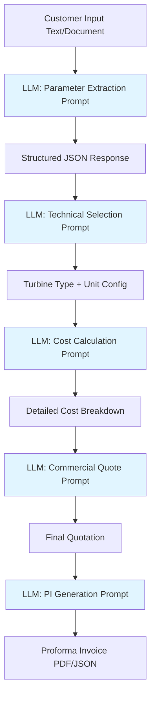

# HydroQuote AI - Database-Free Architecture Plan

## 🎯 Objective

Remove PostgreSQL database entirely and implement a **pure LLM-based quotation system** where all pricing logic, calculations, and decision-making are handled through structured prompts to IBM watsonx.ai API.

---

## 📊 Current State Analysis

### What Currently Exists
- **Documentation**: Comprehensive README.md with database schema and architecture
- **Planning Documents**: Chinese documents detailing pricing rules, workflow, and PI template
- **Empty Implementation**: Dockerfile is empty, no actual code exists yet
- **Database Design**: PostgreSQL schema defined in README for:
  - `inquiries` table
  - `technical_selections` table
  - `cost_calculations` table
  - `pricing_rules` table

### Database Dependencies Identified
1. Historical case data storage
2. Inquiry tracking and status management
3. Technical selection results storage
4. Cost calculation history
5. Pricing rules lookup tables
6. Quote versioning and comparison

---

## 🏗️ New Architecture Design

### Core Principle
**Everything through LLM prompts** - No database, no persistent storage, stateless API design.

### System Flow



### Architecture Components

#### 1. **Stateless API Layer** (FastAPI)
- Single request → Complete quotation pipeline
- No session management
- No data persistence
- Optional: Save final PI as file for customer download

#### 2. **LLM Prompt Engine**
Five specialized prompts replacing database queries:

**Prompt 1: Parameter Extraction**
- Input: Raw customer text/document
- Output: Structured JSON with normalized parameters
- Embedded knowledge: Unit conversion rules, parameter validation

**Prompt 2: Technical Selection**
- Input: Extracted parameters
- Output: Turbine type, unit configuration, equipment list
- Embedded knowledge: All turbine selection logic from documents

**Prompt 3: Cost Calculation**
- Input: Technical selection results
- Output: Itemized cost breakdown
- Embedded knowledge: ALL pricing formulas and rules hardcoded in prompt

**Prompt 4: Commercial Quotation**
- Input: Internal cost
- Output: Commercial quote with 240% markup
- Embedded knowledge: Markup rules, risk reserves

**Prompt 5: PI Generation**
- Input: Commercial quote + customer details
- Output: Formatted Proforma Invoice
- Embedded knowledge: PI template structure, HS codes

#### 3. **Prompt Template Library**
Static files containing:
- Complete pricing formulas
- Turbine selection decision trees
- Unit configuration logic
- All modification factors
- PI template structure

---

## 📋 Detailed Implementation Plan

### Phase 1: Prompt Engineering (Most Critical)

#### 1.1 Create Master Pricing Rules Prompt
Embed ALL pricing rules from [`报价规则.docx`](Planning Docs/报价规则.docx) into a comprehensive prompt:

**Content to Include:**
- Hydro Turbine pricing table (≤500kW to >5000kW)
- Type modification factors (Francis: 1.00, Pelton: 1.08, etc.)
- Generator pricing formulas with interpolation
- Voltage/frequency modification factors
- Speed Governor pricing by capacity range
- Inlet Valve pricing with pressure factors
- Automation System pricing levels
- Personnel cost formula: `USD 20,000 × (Total Capacity / 1000)`
- Risk reserve and after-sales (8%)
- Commercial markup (240%)

**Prompt Structure:**
```
You are a hydro turbine cost estimation specialist. Calculate equipment costs using these EXACT formulas:

HYDRO TURBINE PRICING:
- ≤500kW: Minimum USD 30,000
- 500-1000kW: USD 50/kW
- 1000-1500kW: 50,000 + (Capacity - 1000) × 20
- 1500-3000kW: USD 38-40/kW
- 3000-5000kW: USD 32-38/kW

TYPE FACTORS:
- Francis: 1.00
- Pelton: 1.08
- Kaplan: 1.12
[... continue with ALL rules ...]

CALCULATION STEPS:
1. Calculate base price for each component
2. Apply modification factors
3. Sum main equipment cost
4. Add personnel cost: USD 20,000 × (Total kW / 1000)
5. Apply (1 + Risk% + 8%) for internal cost
6. Multiply by 2.40 for commercial quote

OUTPUT FORMAT: JSON with itemized breakdown
```

#### 1.2 Create Technical Selection Prompt
Embed decision logic from [`Agent报价流程设计.docx`](Planning Docs/Agent报价流程设计.docx):

**Content to Include:**
- Head range → Turbine type mapping
- Flow variation → Unit quantity logic
- Multi-unit recommendation rules
- Equipment configuration standards

**Decision Tree:**
```
IF net_head < 20m AND flow > 5 m³/s:
  → Recommend Kaplan/Tubular/Bulb
ELIF 20m ≤ net_head ≤ 300m AND flow_stable:
  → Recommend Francis
ELIF net_head > 300m:
  → Recommend Pelton
ELIF flow_variation_large:
  → Recommend multiple units with Kaplan
```

#### 1.3 Create Parameter Extraction Prompt
**Capabilities:**
- Extract from natural language or structured documents
- Normalize units (m, m³/s, kW, MW, Hz, V)
- Detect missing parameters
- Flag conflicts or inconsistencies

#### 1.4 Create PI Generation Prompt
Embed template from [`报价单案例.docx`](Planning Docs/报价单案例.docx):

**Template Structure:**
```
Proforma Invoice N: [AUTO-GENERATED]
Date: [CURRENT_DATE]

EQUIPMENT:
Description | HS CODE | Qty | Unit Price | Total(USD)
[Generated from cost calculation]

Delivery time: 8-10 months
Delivery term: FOB China Port
Guarantee: 12 months
Country of manufacturing: China
```

### Phase 2: API Implementation

#### 2.1 Simplified API Endpoints

**Single Endpoint Approach:**
```
POST /api/v1/quotation/generate
{
  "customer_input": "Project in Nepal, 50m head, 10 m³/s flow, 2.5MW",
  "customer_details": {
    "company_name": "Nepal Power Ltd",
    "contact_person": "John Doe",
    "email": "john@example.com"
  },
  "language": "en",
  "include_pi": true
}

Response:
{
  "quotation_id": "QUOTE-2024-001",
  "extracted_parameters": {...},
  "technical_selection": {...},
  "cost_breakdown": {...},
  "commercial_quote": {...},
  "proforma_invoice": {...}
}
```

**Alternative: Step-by-Step Endpoints**
```
POST /api/v1/extract-parameters
POST /api/v1/technical-selection
POST /api/v1/calculate-cost
POST /api/v1/generate-quote
POST /api/v1/generate-pi
```

#### 2.2 LLM Integration Pattern

```python
# Pseudo-code structure
class WatsonxPromptEngine:
    def __init__(self, api_key, project_id):
        self.client = WatsonxClient(api_key, project_id)
        self.prompts = load_prompt_templates()
    
    def extract_parameters(self, customer_input):
        prompt = self.prompts['parameter_extraction'].format(
            input=customer_input
        )
        response = self.client.generate(prompt)
        return parse_json_response(response)
    
    def select_turbine(self, parameters):
        prompt = self.prompts['technical_selection'].format(
            head=parameters['net_head'],
            flow=parameters['design_flow'],
            capacity=parameters['installed_capacity']
        )
        response = self.client.generate(prompt)
        return parse_json_response(response)
    
    def calculate_cost(self, technical_selection):
        # Pricing rules embedded in prompt
        prompt = self.prompts['cost_calculation'].format(
            turbine_type=technical_selection['turbine_type'],
            unit_capacity=technical_selection['unit_capacity'],
            unit_quantity=technical_selection['unit_quantity']
        )
        response = self.client.generate(prompt)
        return parse_json_response(response)
```

### Phase 3: Configuration Management

#### 3.1 Prompt Templates Directory Structure
```
prompts/
├── 01_parameter_extraction.txt
├── 02_technical_selection.txt
├── 03_cost_calculation.txt
├── 04_commercial_quote.txt
├── 05_pi_generation.txt
└── pricing_rules_reference.json (for documentation only)
```

#### 3.2 Environment Configuration
```env
# IBM watsonx.ai Configuration
WATSONX_API_KEY=your_api_key_here
WATSONX_PROJECT_ID=your_project_id
WATSONX_URL=https://us-south.ml.cloud.ibm.com
WATSONX_MODEL=ibm/granite-13b-chat-v2

# Application Configuration
APP_ENV=production
LOG_LEVEL=INFO
API_PORT=8000
ENABLE_PI_DOWNLOAD=true
```

### Phase 4: Deployment Simplification

#### 4.1 Remove Database Components

**Files to Remove/Modify:**
- ❌ Remove PostgreSQL from docker-compose.yml (if exists)
- ❌ Remove SQLAlchemy dependencies
- ❌ Remove psycopg2-binary
- ❌ Remove database migration scripts
- ❌ Remove database schema definitions

**Dependencies to Keep:**
```
fastapi>=0.104.0
uvicorn>=0.24.0
pydantic>=2.5.0
ibm-watsonx-ai>=0.1.0
python-multipart>=0.0.6
jinja2>=3.1.2
```

#### 4.2 Simplified Dockerfile
```dockerfile
FROM python:3.11-slim

WORKDIR /app

COPY requirements.txt .
RUN pip install --no-cache-dir -r requirements.txt

COPY . .

EXPOSE 8000

CMD ["uvicorn", "app.main:app", "--host", "0.0.0.0", "--port", "8000"]
```

#### 4.3 Docker Compose (Optional)
```yaml
version: '3.8'

services:
  api:
    build: .
    ports:
      - "8000:8000"
    environment:
      - WATSONX_API_KEY=${WATSONX_API_KEY}
      - WATSONX_PROJECT_ID=${WATSONX_PROJECT_ID}
    volumes:
      - ./prompts:/app/prompts
```

---

## 🎯 Key Advantages of Database-Free Design

### 1. **Simplicity**
- No database setup, migrations, or maintenance
- Single container deployment
- Easier to scale horizontally

### 2. **Flexibility**
- Pricing rules updated by editing prompt templates
- No schema migrations needed
- Instant rule changes without database updates

### 3. **Transparency**
- All logic visible in prompt templates
- Easy to audit and understand
- No hidden database state

### 4. **Cost Efficiency**
- No database hosting costs
- Reduced infrastructure complexity
- Pay only for LLM API calls

### 5. **Stateless Architecture**
- Each request is independent
- No session management complexity
- Easy to cache and optimize

---

## ⚠️ Considerations & Limitations

### 1. **No Historical Data**
- Cannot analyze past quotations
- Cannot track quote success rates
- Cannot do price trend analysis
- **Mitigation**: Optional file-based logging for analytics

### 2. **No Quote Versioning**
- Cannot compare multiple quote versions
- Cannot track quote modifications
- **Mitigation**: Return complete quote in single response

### 3. **LLM Consistency**
- Same input might produce slightly different outputs
- **Mitigation**: Use temperature=0 for deterministic results
- **Mitigation**: Validate outputs with Pydantic models

### 4. **Cost per Request**
- Each quotation requires 5 LLM API calls
- **Mitigation**: Optimize prompts for efficiency
- **Mitigation**: Consider caching common scenarios

### 5. **Prompt Size Limits**
- All pricing rules must fit in prompt context
- **Mitigation**: Current rules fit easily within limits
- **Mitigation**: Use structured JSON in prompts

---

## 📝 Implementation Checklist

### Prompt Engineering Tasks
- [ ] Create parameter extraction prompt with unit normalization
- [ ] Create technical selection prompt with decision tree
- [ ] Create cost calculation prompt with ALL pricing formulas
- [ ] Create commercial quote prompt with markup rules
- [ ] Create PI generation prompt with template structure
- [ ] Test each prompt independently with sample data
- [ ] Validate JSON output parsing for all prompts

### API Development Tasks
- [ ] Set up FastAPI project structure
- [ ] Implement WatsonxClient wrapper
- [ ] Create prompt template loader
- [ ] Implement `/quotation/generate` endpoint
- [ ] Add input validation with Pydantic
- [ ] Add error handling and logging
- [ ] Create API documentation with examples

### Configuration Tasks
- [ ] Create `.env.example` file
- [ ] Document all environment variables
- [ ] Create prompt template directory
- [ ] Add prompt versioning strategy

### Documentation Tasks
- [ ] Update README.md with new architecture
- [ ] Remove database schema section
- [ ] Update system architecture diagram
- [ ] Add prompt engineering guidelines
- [ ] Create API usage examples
- [ ] Document deployment process

### Testing Tasks
- [ ] Test parameter extraction with various inputs
- [ ] Test technical selection logic
- [ ] Validate cost calculations against manual calculations
- [ ] Test complete quotation pipeline
- [ ] Test error handling and edge cases

---

## 🚀 Deployment Steps

### 1. Development Environment
```bash
# Clone repository
git clone <repo-url>
cd hydroquote-ai

# Create virtual environment
python -m venv venv
source venv/bin/activate  # or venv\Scripts\activate on Windows

# Install dependencies
pip install -r requirements.txt

# Configure environment
cp .env.example .env
# Edit .env with IBM watsonx.ai credentials

# Run development server
uvicorn app.main:app --reload
```

### 2. Production Deployment
```bash
# Build Docker image
docker build -t hydroquote-ai:latest .

# Run container
docker run -d \
  -p 8000:8000 \
  -e WATSONX_API_KEY=your_key \
  -e WATSONX_PROJECT_ID=your_project \
  --name hydroquote-api \
  hydroquote-ai:latest
```

### 3. Verification
```bash
# Health check
curl http://localhost:8000/health

# Test quotation
curl -X POST http://localhost:8000/api/v1/quotation/generate \
  -H "Content-Type: application/json" \
  -d '{
    "customer_input": "Nepal project, 50m head, 10 m³/s, 2.5MW",
    "language": "en"
  }'
```

---

## 📊 Success Metrics

### Technical Metrics
- API response time < 30 seconds for complete quotation
- LLM output parsing success rate > 95%
- Cost calculation accuracy within 2% of manual calculation

### Business Metrics
- Quotation generation time: Minutes (vs. days/weeks traditional)
- System uptime: > 99%
- Cost per quotation: < $1 in LLM API calls

---

## 🔄 Future Enhancements (Optional)

### Phase 2 Features (If Needed)
1. **Simple File-Based Logging**
   - Save quotations as JSON files for reference
   - No complex queries, just file storage

2. **Quote Comparison Tool**
   - Load 2-3 saved quotes and compare
   - Still no database, just file operations

3. **Prompt Optimization**
   - A/B test different prompt structures
   - Measure accuracy and consistency

4. **Multi-Language Support**
   - Chinese/English prompt variants
   - Language-specific PI templates

---

## 📞 Next Steps

1. **Review this plan** with the team
2. **Approve the architecture** approach
3. **Start with prompt engineering** (most critical)
4. **Implement API layer** once prompts are validated
5. **Test thoroughly** before deployment

---

**Document Version**: 1.0  
**Last Updated**: 2024-05-02  
**Status**: Ready for Implementation