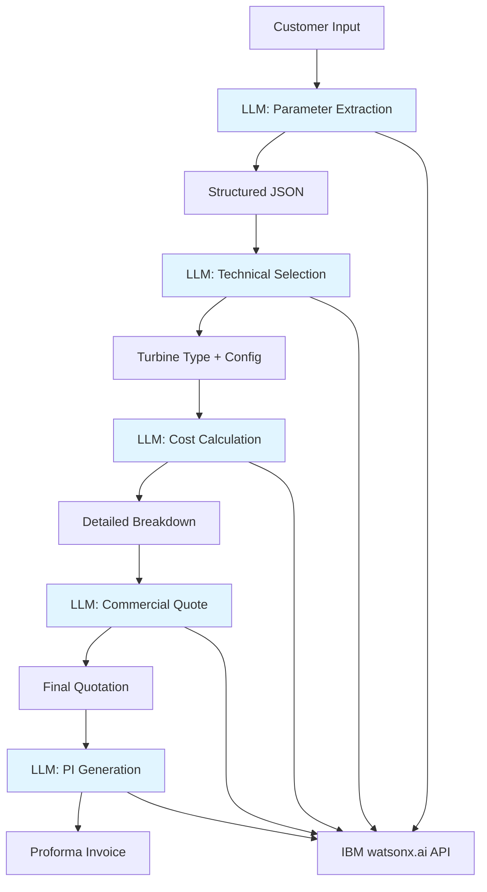

# HydroQuote AI - Intelligent Hydro Turbine Quotation System

## 🎯 Project Overview

HydroQuote AI is an intelligent quotation system that automates the hydro turbine selection and pricing process. It transforms the traditional workflow from **Customer Inquiry → Engineer Design → Supply Chain → Quote** (days/weeks) into an AI-powered instant quotation system using historical case data and prompt engineering.

### Key Features
- 🤖 AI-powered customer inquiry processing
- ⚡ Automated turbine type selection
- 💰 Intelligent pricing based on historical data
- 📊 Multi-unit configuration optimization
- 📄 Automated Proforma Invoice (PI) generation
- 🌐 Multi-language support (English/Chinese)

---

## 🏗️ System Architecture

### Prompt-Driven LLM Architecture



**Key Design Principles:**
- ✅ **Prompt-Centric Logic** - Rules and calculations are managed in prompts
- ✅ **Stateless Architecture** - Each request is independent
- ✅ **Embedded Pricing Rules** - Formulas hardcoded in prompts
- ✅ **Single API Call** - Complete quotation in one request

### Five-Prompt LLM Pipeline

All processing is handled through specialized LLM prompts for a streamlined stateless workflow.

#### 1. Parameter Extraction Prompt
**Input**: Raw customer text or uploaded document
**Output**: Structured JSON with normalized parameters

**Capabilities**:
- Extract project parameters from natural language
- Normalize units (m, m³/s, kW, MW, Hz, V)
- Detect missing information
- Flag conflicts or inconsistencies
- Validate parameter ranges

#### 2. Technical Selection Prompt
**Input**: Extracted parameters
**Output**: Turbine type, unit configuration, equipment list

**Embedded Logic**:
- Head range → Turbine type mapping
- Flow variation → Unit quantity recommendation
- Capacity scale → Configuration options
- Decision tree for turbine selection

#### 3. Cost Calculation Prompt
**Input**: Technical selection results
**Output**: Itemized cost breakdown

**Embedded Pricing Rules**:
- All equipment pricing formulas (Turbine, Generator, Governor, Valve, Automation)
- Type modification factors
- Voltage/frequency adjustments
- Personnel cost calculation
- Complete pricing tables from 500kW to 5000kW

#### 4. Commercial Quote Prompt
**Input**: Internal cost calculation
**Output**: Commercial quotation with markup

**Embedded Rules**:
- Commercial markup application
- Risk reserve calculation (8% after-sales)
- Professional quote formatting

#### 5. PI Generation Prompt
**Input**: Commercial quote + customer details
**Output**: Formatted Proforma Invoice

**Embedded Template**:
- Standard PI structure
- HS codes for equipment
- Delivery terms and warranty
- Payment terms

---

## 📋 Required Parameters

### Essential Parameters
| Category | Parameters | Example |
|----------|-----------|---------|
| **Business Info** | Project Name, Country, Location, Customer Contact | "Nepal Hydro Project, Kathmandu" |
| **Hydraulic Core** | Net Head, Design Flow, Installed Capacity | 50m, 10 m³/s, 2500 kW |
| **Electrical** | Frequency, Generator Voltage | 50 Hz, 6.3 kV |
| **Unit Config** | Number of Units, Unit Capacity | 2 units × 1250 kW |
| **Commercial** | Currency (default USD) | USD |

### Optional Parameters
- Minimum/Maximum flow rates
- Sediment content
- Flow duration curve
- Automation level requirements
- Remote monitoring needs

---

## 🔧 Technical Selection Logic

### Turbine Type Selection

**Decision Matrix**:

| Head Range | Flow Characteristics | Recommended Type | Reason |
|------------|---------------------|------------------|---------|
| Low (< 20m) | Large flow | Kaplan/Tubular/Bulb | Optimal for low head, high flow |
| Medium (20-300m) | Stable flow | Francis | Most efficient for medium head |
| High (> 300m) | Small flow | Pelton | Ideal for high head, low flow |
| Variable | Large fluctuation | Kaplan (adjustable) | Adapts to flow changes |
| Low budget | Simple structure | Cross-flow | Cost-effective solution |

**Type Modification Factors**:
- Francis: 1.00 (baseline)
- Pelton: 1.08
- Kaplan: 1.12
- Tubular: 1.15
- Bulb: 1.20
- Cross-flow: 0.85

### Unit Configuration Strategy

**Multi-unit Recommendation Logic**:
- Large flow variation → Multiple units for flexibility
- Stable flow + low cost → Fewer units
- Large capacity (>10MW) → Generate multiple options (1×10MW, 2×5MW, 4×2.5MW)
- Year-round operation → Mixed capacity or multiple same-capacity units

**Example Output**:
> "Recommended: 2×5MW. Compared to 1×10MW, it offers better operational flexibility at partial flow, while being less complex than 4×2.5MW in terms of cost and maintenance."

---

## 💰 Pricing Rules

### 3.1 Main Equipment Base Cost

#### Hydro Turbine Pricing

| Capacity Range | Base Price Formula | Example |
|----------------|-------------------|---------|
| ≤500 kW | Minimum USD 30,000 | - |
| 500-1000 kW | USD 50/kW | 800 kW = USD 40,000 |
| 1000-1500 kW | 50,000 + (Cap - 1000) × 20 | 1200 kW = USD 54,000 |
| 1500-3000 kW | USD 38-40/kW | 2000 kW = USD 76,000 |
| 3000-5000 kW | USD 32-38/kW | 4000 kW = USD 140,000 |
| >5000 kW | Manual review required | - |

**Formula**:
```
Hydro Turbine Cost = Base Price × Type Factor × Unit Quantity
```

#### Generator and Exciter/AVR Pricing

| Capacity Range | Base Price Formula | Example |
|----------------|-------------------|---------|
| ≤500 kW | Minimum USD 40,000 | - |
| 500-1000 kW | USD 75/kW | 800 kW = USD 60,000 |
| 1000-1500 kW | 75,000 + (Cap - 1000) × 37 | 1200 kW = USD 82,400 |
| 1500-3000 kW | USD 58-62/kW | 2000 kW = USD 120,000 |
| 3000-5000 kW | USD 50-58/kW | 4000 kW = USD 216,000 |

**Modification Factors**:
- Standard voltage, 50Hz: 1.00
- 60Hz: 1.05
- High voltage: 1.08-1.15
- Low speed large diameter: 1.10-1.25

#### Speed Governor Pricing

| Capacity Range | Base Price | Automation Factor |
|----------------|-----------|-------------------|
| ≤1000 kW | USD 13,500 | Basic: 1.00 |
| 1000-1500 kW | 13,500 + (Cap - 1000) × 3 | Standard: 1.10 |
| 1500-3000 kW | USD 15,000-22,000 | Advanced: 1.20 |
| 3000-5000 kW | USD 22,000-35,000 | - |

#### Inlet Valve Pricing

| Capacity Range | Base Price | Pressure Factor |
|----------------|-----------|-----------------|
| ≤1000 kW | USD 11,800 | Low pressure: 1.00 |
| 1000-1500 kW | 11,800 + (Cap - 1000) × 13.4 | Medium-high: 1.10-1.30 |
| 1500-3000 kW | USD 18,500-35,000 | With hydraulic: 1.15-1.40 |
| 3000-5000 kW | USD 35,000-60,000 | - |

#### Automation System Pricing

| Level | Configuration | Price Range |
|-------|--------------|-------------|
| Basic | Basic automation elements, simple control | USD 1,900-5,000 |
| Standard | PLC, HMI, sensors, protection | USD 8,000-15,000 |
| Advanced | SCADA, remote monitoring, grid sync | USD 15,000-30,000+ |

### 3.2 Project Additional Costs

**Personnel Cost Formula**:
```
Personnel Cost = USD 20,000 × (Total Capacity / 1000)
```

Includes:
- Engineering design
- Technical drawings
- Technical documentation
- Factory testing
- Packaging and rust prevention
- Domestic transportation to port

**Example**:
- 1000 kW → USD 20,000
- 2500 kW → USD 50,000
- 5000 kW → USD 100,000

### 3.3 Internal Cost Price

**Formula**:
```
Internal Cost = (Main Equipment Base Cost + Project Additional Cost) × (1 + Risk Reserve + 8%)
```

Where:
- Risk Reserve: Project-specific (typically 5-10%)
- 8%: After-sales service reserve

### 3.4 Commercial Quotation

**Formula**:
```
Commercial Quotation = Internal Cost × 2.40
```

This markup strategy covers:
- Profit margin
- Negotiation buffer
- Exchange rate fluctuation
- Business communication overhead
- Project uncertainties

---

## 🚀 Technology Stack

### Core Technologies
- **AI/ML**: IBM watsonx.ai API (All logic via LLM prompts)
- **Backend**: Python 3.11+ with FastAPI
- **Containerization**: Docker
- **API Documentation**: OpenAPI/Swagger

### Key Dependencies
```
fastapi>=0.104.0
uvicorn>=0.24.0
pydantic>=2.5.0
ibm-watsonx-ai>=0.1.0
python-multipart>=0.0.6
jinja2>=3.1.2
```

**Note**: Core business logic is embedded in LLM prompts.

---

## 🎨 Prompt Engineering Strategy

### Pipeline Structure

#### 1. Customer Input Processing Prompt
```
Role: Technical Parameter Extractor
Task: Extract and normalize hydro turbine project parameters
Input: Customer text or uploaded project document
Output: Structured JSON with normalized units

Required extractions:
- Project name, country, location
- Net head (m), design flow (m³/s), capacity (kW/MW)
- Voltage (V/kV), frequency (Hz)
- Number of units, unit capacity

Validation rules:
- Detect unit inconsistencies
- Flag missing critical parameters
- Identify conflicting values
```

#### 2. Technical Selection Prompt
```
Role: Hydro Turbine Selection Engineer
Task: Select optimal turbine type and unit configuration
Input: Normalized project parameters
Output: Technical recommendation with reasoning

Decision criteria:
- Head range → Turbine type mapping
- Flow variation → Unit quantity recommendation
- Capacity scale → Configuration options
- Budget constraints → Cost-performance balance

Output format:
- Recommended turbine type with justification
- Unit configuration (e.g., 2×5MW) with comparison
- Main equipment list
- Technical assumptions and risks
```

#### 3. Cost Calculation Prompt
```
Role: Cost Estimation Specialist
Task: Calculate equipment costs using pricing rules
Input: Technical selection results
Output: Detailed cost breakdown

Calculation steps:
1. Main equipment base cost (5 components)
2. Apply type/voltage/automation factors
3. Add project additional costs
4. Apply risk reserves and after-sales margin
5. Generate internal cost price

Output format:
- Itemized equipment costs
- Modification factors applied
- Total internal cost
- Cost calculation transparency
```

#### 4. Commercial Quote Generation Prompt
```
Role: Commercial Quotation Manager
Task: Generate customer-facing quotation
Input: Internal cost price
Output: Commercial quotation with markup

Components:
- Apply commercial markup
- Format as professional quotation
- Include delivery terms
- Add payment terms
- Generate PI-ready format
```

### Response Format Standards

All AI responses follow structured JSON format:
```json
{
  "status": "success|partial|error",
  "data": {
    "extracted_parameters": {},
    "technical_selection": {},
    "cost_breakdown": {},
    "commercial_quote": {}
  },
  "missing_parameters": [],
  "warnings": [],
  "next_action": "confirm|calculate|generate_pi"
}
```

---

## 📦 Installation & Deployment

### Prerequisites
- Docker 24.0+
- Docker Compose 2.20+
- IBM watsonx.ai API credentials

### Quick Start

1. **Clone Repository**
```bash
git clone https://github.com/your-org/hydroquote-ai.git
cd hydroquote-ai
```

2. **Configure Environment**
```bash
cp .env.example .env
# Edit .env with your IBM watsonx.ai credentials
```

3. **Build and Run**
```bash
# Using Docker
docker build -t hydroquote-ai .
docker run -d -p 8000:8000 --env-file .env hydroquote-ai

# Or run directly
pip install -r requirements.txt
uvicorn app.main:app --host 0.0.0.0 --port 8000
```

4. **Access Application**
- API: http://localhost:8000
- Swagger Docs: http://localhost:8000/docs
- Health Check: http://localhost:8000/health

### Environment Variables

```env
# IBM watsonx.ai Configuration (Required)
WATSONX_API_KEY=your_api_key_here
WATSONX_PROJECT_ID=your_project_id
WATSONX_URL=https://us-south.ml.cloud.ibm.com
WATSONX_MODEL=ibm/granite-13b-chat-v2

# Application Configuration
APP_ENV=production
LOG_LEVEL=INFO
API_PORT=8000
```

**Note**: No persistent data service configuration is required; the system is stateless.

---

## 📚 API Endpoints

### Single Endpoint - Complete Quotation

```http
POST /api/v1/quotation/generate
Content-Type: application/json

{
  "customer_input": "Project in Nepal, 50m head, 10 m³/s flow, 2.5MW capacity",
  "customer_details": {
    "company_name": "Nepal Power Ltd",
    "contact_person": "John Doe",
    "email": "john@nepalpower.com"
  },
  "language": "en",
  "include_pi": true
}
```

**Response**:
```json
{
  "quotation_id": "QUOTE-2024-001",
  "timestamp": "2024-05-02T10:30:00Z",
  
  "extracted_parameters": {
    "project_name": "Nepal Hydro Project",
    "country": "Nepal",
    "net_head": 50,
    "design_flow": 10,
    "installed_capacity": 2500,
    "frequency": 50,
    "voltage": 6300
  },
  
  "technical_selection": {
    "turbine_type": "Francis",
    "unit_configuration": "2×1250kW",
    "main_equipment": [
      "Hydro Turbine (Francis)",
      "Generator and Exciter/AVR",
      "Speed Governor",
      "Inlet Valve",
      "Automation System (Standard PLC)"
    ],
    "reasoning": "Francis turbine recommended for 50m head with stable flow..."
  },
  
  "cost_breakdown": {
    "main_equipment_cost": 285000,
    "project_additional_cost": 50000,
    "internal_cost": 362000,
    "commercial_quote": 868800,
    "itemized": {
      "hydro_turbine": 100000,
      "generator": 150000,
      "governor": 27000,
      "inlet_valve": 28000,
      "automation": 20000
    }
  },
  
  "proforma_invoice": {
    "invoice_number": "PI-2024-001",
    "total_usd": 868800,
    "delivery_time": "8-10 months",
    "payment_terms": "30% advance, 70% before shipment",
    "pdf_url": "/downloads/PI-2024-001.pdf"
  }
}
```

### Alternative: Step-by-Step Endpoints

For clients who need granular control:

```http
POST /api/v1/extract-parameters
POST /api/v1/technical-selection
POST /api/v1/calculate-cost
POST /api/v1/generate-quote
POST /api/v1/generate-pi
```

---

## 📝 Prompt Engineering Architecture

### How Pricing Rules Are Embedded

All pricing logic is embedded directly in LLM prompts:

**Example: Cost Calculation Prompt Structure**
```
You are a hydro turbine cost estimation specialist. Calculate equipment costs using these EXACT formulas:

HYDRO TURBINE PRICING:
- ≤500kW: Minimum USD 30,000
- 500-1000kW: USD 50/kW
- 1000-1500kW: 50,000 + (Capacity - 1000) × 20
- 1500-3000kW: USD 38-40/kW
- 3000-5000kW: USD 32-38/kW

TYPE MODIFICATION FACTORS:
- Francis: 1.00 (baseline)
- Pelton: 1.08
- Kaplan: 1.12
- Tubular: 1.15
- Bulb: 1.20
- Cross-flow: 0.85

GENERATOR PRICING:
- ≤500kW: Minimum USD 40,000
- 500-1000kW: USD 75/kW
- 1000-1500kW: 75,000 + (Capacity - 1000) × 37
[... complete pricing tables ...]

CALCULATION STEPS:
1. Calculate base price for each component
2. Apply modification factors
3. Sum main equipment cost
4. Add personnel cost: USD 20,000 × (Total kW / 1000)
5. Apply (1 + Risk% + 8%) for internal cost
6. Multiply by 2.40 for commercial quote

OUTPUT: Return JSON with itemized breakdown
```

**Benefits**:
- ✅ No external table lookups
- ✅ Rules visible and auditable in prompts
- ✅ Easy to update by editing prompt templates
- ✅ Consistent calculations every time
- ✅ Complete transparency in pricing logic

---

## 🧪 Testing

### Run Tests
```bash
# Unit tests
pytest tests/unit/

# Integration tests
pytest tests/integration/

# API tests
pytest tests/api/

# All tests with coverage
pytest --cov=app tests/
```

### Test Coverage Goals
- Unit tests: >80%
- Integration tests: >70%
- API endpoint tests: 100%

---

## 📊 Example Use Case

### Complete Workflow Example

**Step 1: Customer Input**
```
"We have a hydro project in Nepal, Kathmandu region. 
The site has 50 meters net head and 10 cubic meters per second design flow. 
We need 2.5 MW total capacity. 
Standard 50Hz frequency and 6.3kV voltage."
```

**Step 2: AI Extraction**
- Project: Nepal Hydro Project
- Location: Kathmandu, Nepal
- Net Head: 50 m
- Design Flow: 10 m³/s
- Capacity: 2500 kW
- Frequency: 50 Hz
- Voltage: 6.3 kV

**Step 3: Technical Selection**
- Turbine Type: Francis (optimal for 50m head)
- Configuration: 2×1250 kW (better flexibility than 1×2500 kW)
- Main Equipment:
  - 2× Francis Turbine
  - 2× Generator with Exciter/AVR
  - 2× Speed Governor
  - 2× Inlet Valve
  - 1× Standard PLC Automation System

**Step 4: Cost Calculation**
- Hydro Turbine: 2 × USD 55,000 = USD 110,000
- Generator: 2 × USD 83,750 = USD 167,500
- Governor: 2 × USD 14,250 = USD 28,500
- Inlet Valve: 2 × USD 15,150 = USD 30,300
- Automation: USD 10,000
- **Main Equipment Total**: USD 346,300
- Project Additional Cost: USD 50,000
- Internal Cost (with 8% after-sales): USD 427,604
- **Commercial Quote**: USD 1,026,250

**Step 5: PI Generation**
Professional Proforma Invoice with:
- Itemized equipment list
- HS codes for customs
- Delivery terms: 8-10 months
- Payment terms
- Warranty information

---

## 🔍 Architecture Benefits & Considerations

### ✅ Architecture Advantages

1. **Simplicity**
   - Minimal infrastructure setup and maintenance
   - Single container deployment
   - Easier to scale horizontally
   - Reduced infrastructure complexity

2. **Flexibility**
   - Pricing rules updated by editing prompt templates
   - No schema migrations needed
   - Instant rule changes through prompt updates
   - Easy to version control prompts

3. **Transparency**
   - All logic visible in prompt templates
   - Easy to audit and understand
   - Clear rule traceability
   - Clear pricing calculations

4. **Cost Efficiency**
   - Lower infrastructure costs
   - Reduced infrastructure complexity
   - Pay only for LLM API calls
   - Lower operational overhead

5. **Stateless Architecture**
   - Each request is independent
   - No session management complexity
   - Easy to cache and optimize
   - Horizontal scaling without coordination

### ⚠️ Considerations

1. **No Historical Data**
   - Cannot analyze past quotations
   - Cannot track quote success rates
   - Cannot do price trend analysis
   - **Mitigation**: Optional file-based logging for analytics

2. **No Quote Versioning**
   - Cannot compare multiple quote versions
   - Cannot track quote modifications
   - **Mitigation**: Return complete quote in single response

3. **LLM Consistency**
   - Same input might produce slightly different outputs
   - **Mitigation**: Use temperature=0 for deterministic results
   - **Mitigation**: Validate outputs with Pydantic models

4. **Cost per Request**
   - Each quotation requires 5 LLM API calls
   - **Mitigation**: Optimize prompts for efficiency
   - **Mitigation**: Consider caching common scenarios

### 🚀 Future Enhancements (Optional)

**Phase 2 Features** (If Needed):
1. **Simple File-Based Logging**
   - Save quotations as JSON files for reference
   - No complex queries, just file storage

2. **Document Upload Processing**
   - PDF/DOCX parsing for project specifications
   - OCR for scanned documents
   - Multi-language document support

3. **Quote Comparison Tool**
   - Load 2-3 saved quotes and compare
   - File-based comparison workflow

4. **Multi-Language Support**
   - Chinese/English prompt variants
   - Language-specific PI templates

5. **Web UI Development**
   - Interactive parameter input forms
   - Real-time quotation preview
   - Quote download functionality

---

## 🤝 Contributing

Contributions are welcome! Please follow these guidelines:

1. Fork the repository
2. Create a feature branch (`git checkout -b feature/AmazingFeature`)
3. Commit your changes (`git commit -m 'Add some AmazingFeature'`)
4. Push to the branch (`git push origin feature/AmazingFeature`)
5. Open a Pull Request

### Code Style
- Follow PEP 8 for Python code
- Use type hints
- Write docstrings for all functions
- Maintain test coverage >80%

---

## 📄 License

This project is licensed under the MIT License - see the [LICENSE](LICENSE) file for details.

---

## 👥 Team

**OIOteam - IBM Hackathon 2024**

- Project Lead: [Name]
- AI/ML Engineer: [Name]
- Backend Developer: [Name]
- Solution Architect: [Name]

---

## 📞 Support

For questions or support:
- Email: support@hydroquote-ai.com
- Documentation: https://docs.hydroquote-ai.com
- Issues: https://github.com/your-org/hydroquote-ai/issues

---

## 🙏 Acknowledgments

- IBM watsonx.ai for AI capabilities
- FastAPI framework
- Open source ecosystem
- Docker containerization
- Open source community

---

**Last Updated**: 2024-05-02
**Version**: 2.0.0 - Prompt-Driven Architecture
**Status**: Ready for Implementation

---

## 📖 Additional Documentation

- [`ARCHITECTURE_REDESIGN_PLAN.md`](ARCHITECTURE_REDESIGN_PLAN.md) - Detailed implementation plan for the prompt-driven architecture
- [`Planning Docs/`](Planning Docs/) - Original Chinese planning documents with pricing rules and workflow design
